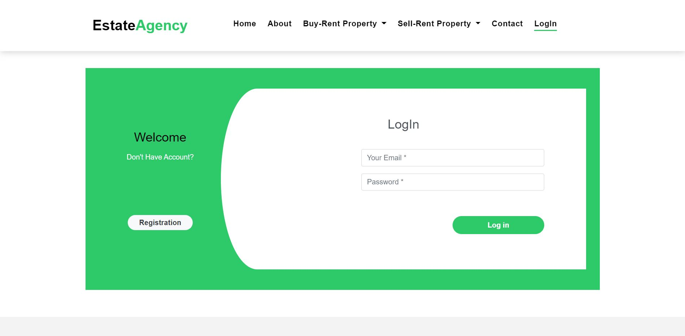
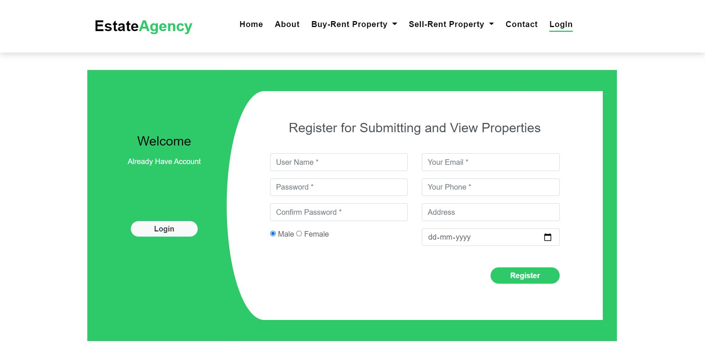
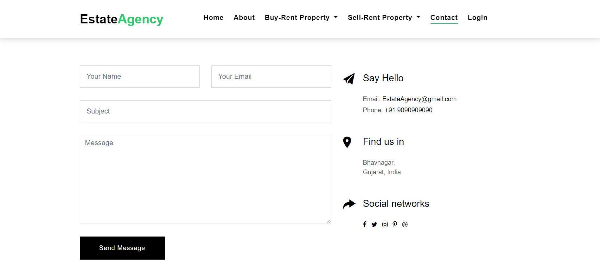

- User can sell & buy properties.
- Agents can add thier properties.
- Admin can view the report of all the properties and users.
 
<b>Dependency Used:</b>
- django : for web application
- pyrebase : for accessing firebase database
 
<b>Database Used:</b>
- Firebase
 
<b>Screen 1:</b> 

 
<b>Screen 2:</b> 

 
<b>Screen 3:</b> 

 
<b>Screen 4:</b> 

